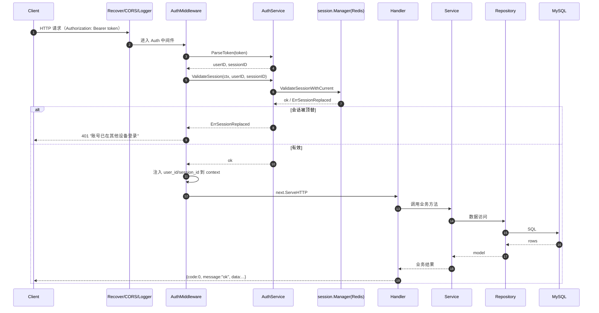
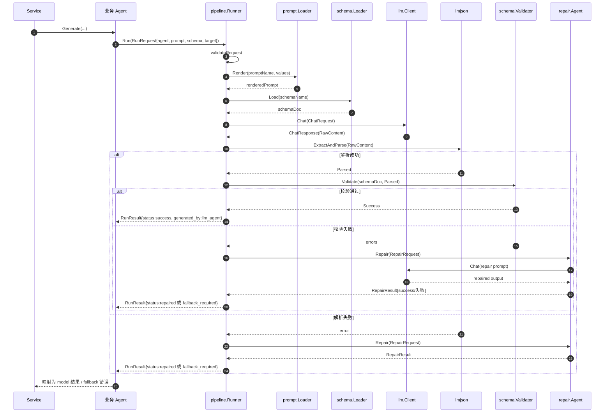
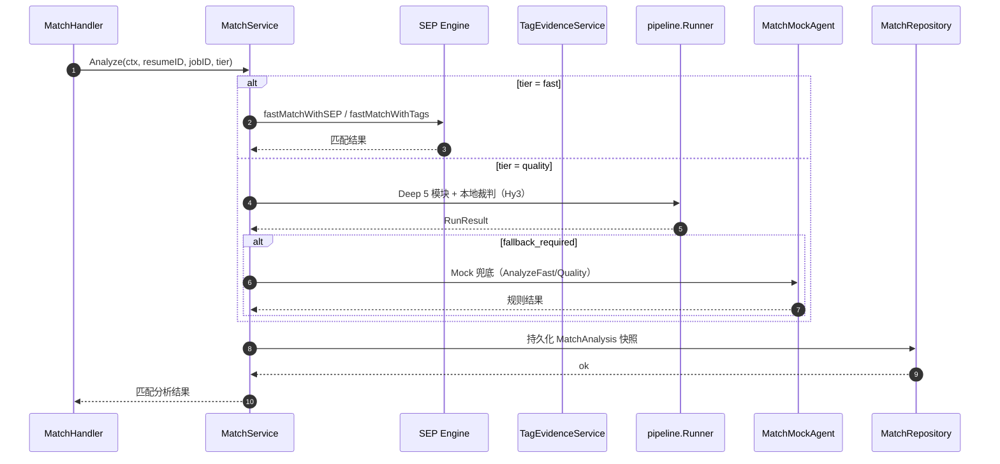
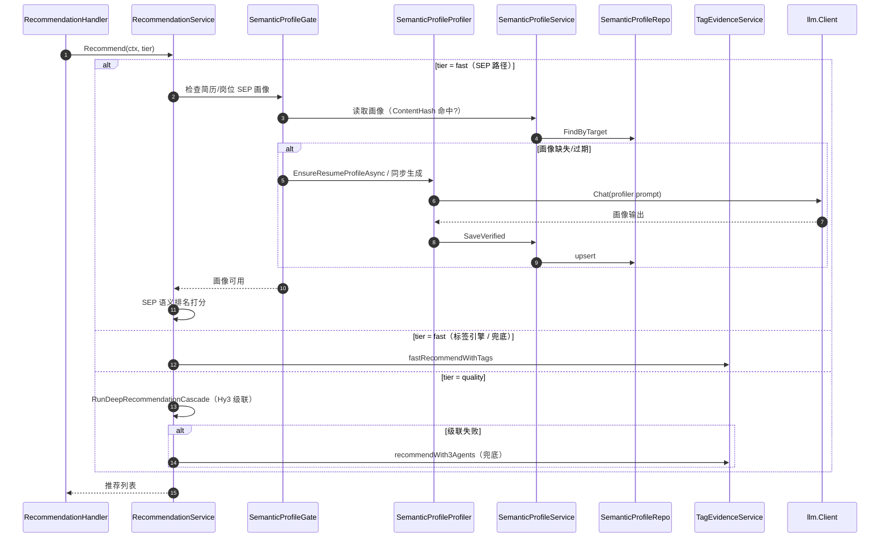
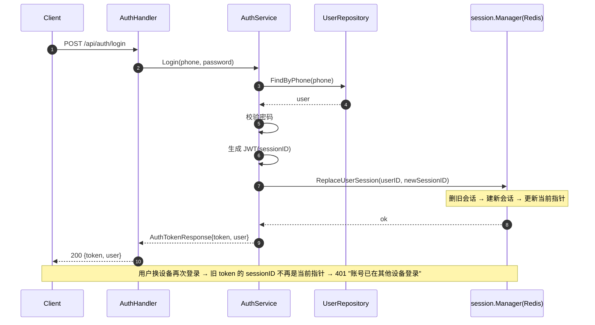
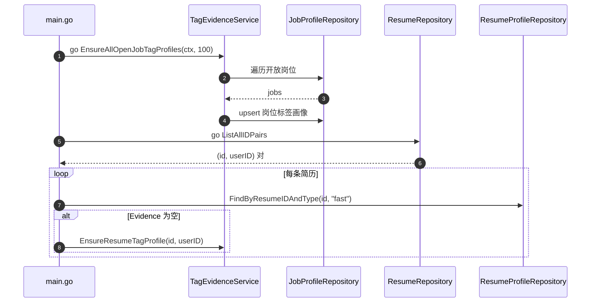

# 08 — 关键业务时序图

## 1. 受保护请求完整链路（鉴权 + 业务）

```mermaid
sequenceDiagram
    autonumber
    participant C as Client
    participant RW as Recover/CORS/Logger
    participant AU as AuthMiddleware
    participant AS as AuthService
    participant SM as session.Manager(Redis)
    participant H as Handler
    participant S as Service
    participant R as Repository
    participant DB as MySQL

    C->>RW: HTTP 请求（Authorization: Bearer token）
    RW->>AU: 进入 Auth 中间件
    AU->>AS: ParseToken(token)
    AS-->>AU: userID, sessionID
    AU->>AS: ValidateSession(ctx, userID, sessionID)
    AS->>SM: ValidateSessionWithCurrent
    SM-->>AS: ok / ErrSessionReplaced
    alt 会话被顶替
        AS-->>AU: ErrSessionReplaced
        AU-->>C: 401 "账号已在其他设备登录"
    else 有效
        AS-->>AU: ok
        AU->>AU: 注入 user_id/session_id 到 context
        AU->>H: next.ServeHTTP
        H->>S: 调用业务方法
        S->>R: 数据访问
        R->>DB: SQL
        DB-->>R: rows
        R-->>S: model
        S-->>H: 业务结果
        H-->>C: {code:0, message:"ok", data:...}
    end
```

## 2. 统一 LLM Pipeline 时序（一次生成 + 修复 + 兜底）

```mermaid
sequenceDiagram
    autonumber
    participant S as Service
    participant A as 业务 Agent
    participant P as pipeline.Runner
    participant PL as prompt.Loader
    participant SL as schema.Loader
    participant L as llm.Client
    participant J as llmjson
    participant V as schema.Validator
    participant RP as repair.Agent

    S->>A: Generate(...)
    A->>P: Run(RunRequest{agent, prompt, schema, target})
    P->>P: validateRequest
    P->>PL: Render(promptName, values)
    PL-->>P: renderedPrompt
    P->>SL: Load(schemaName)
    SL-->>P: schemaDoc
    P->>L: Chat(ChatRequest)
    L-->>P: ChatResponse(RawContent)
    P->>J: ExtractAndParse(RawContent)
    alt 解析成功
        J-->>P: Parsed
        P->>V: Validate(schemaDoc, Parsed)
        alt 校验通过
            V-->>P: Success
            P-->>A: RunResult{status:success, generated_by:llm_agent}
        else 校验失败
            V-->>P: errors
            P->>RP: Repair(RepairRequest)
            RP->>L: Chat(repair prompt)
            L-->>RP: repaired output
            RP-->>P: RepairResult{success/失败}
            P-->>A: RunResult{status:repaired 或 fallback_required}
        end
    else 解析失败
        J-->>P: error
        P->>RP: Repair(RepairRequest)
        RP-->>P: RepairResult
        P-->>A: RunResult{status:repaired 或 fallback_required}
    end
    A-->>S: 映射为 model 结果 / fallback 错误
```

## 3. 岗位匹配（fast/quality 分级 + Mock 兜底）

```mermaid
sequenceDiagram
    autonumber
    participant H as MatchHandler
    participant MS as MatchService
    participant SEP as SEP Engine
    participant TAG as TagEvidenceService
    participant P as pipeline.Runner
    participant M as MatchMockAgent
    participant R as MatchRepository

    H->>MS: Analyze(ctx, resumeID, jobID, tier)
    alt tier = fast
        MS->>SEP: fastMatchWithSEP / fastMatchWithTags
        SEP-->>MS: 匹配结果
    else tier = quality
        MS->>P: Deep 5 模块 + 本地裁判（Hy3）
        P-->>MS: RunResult
        alt fallback_required
            MS->>M: Mock 兜底（AnalyzeFast/Quality）
            M-->>MS: 规则结果
        end
    end
    MS->>R: 持久化 MatchAnalysis 快照
    R-->>MS: ok
    MS-->>H: 匹配分析结果
```

## 4. 岗位推荐（SEP Gate 异步画像）

```mermaid
sequenceDiagram
    autonumber
    participant H as RecommendationHandler
    participant RS as RecommendationService
    participant G as SemanticProfileGate
    participant P as SemanticProfileProfiler
    participant LS as SemanticProfileService
    participant SR as SemanticProfileRepo
    participant T as TagEvidenceService
    participant L as llm.Client

    H->>RS: Recommend(ctx, tier)
    alt tier = fast（SEP 路径）
        RS->>G: 检查简历/岗位 SEP 画像
        G->>LS: 读取画像（ContentHash 命中?）
        LS->>SR: FindByTarget
        alt 画像缺失/过期
            G->>P: EnsureResumeProfileAsync / 同步生成
            P->>L: Chat(profiler prompt)
            L-->>P: 画像输出
            P->>LS: SaveVerified
            LS->>SR: upsert
        end
        G-->>RS: 画像可用
        RS->>RS: SEP 语义排名打分
    else tier = fast（标签引擎 / 兜底）
        RS->>T: fastRecommendWithTags
    else tier = quality
        RS->>RS: RunDeepRecommendationCascade（Hy3 级联）
        alt 级联失败
            RS->>T: recommendWith3Agents（兜底）
        end
    end
    RS-->>H: 推荐列表
```

## 5. 登录与会话顶替

```mermaid
sequenceDiagram
    autonumber
    participant C as Client
    participant AH as AuthHandler
    participant AS as AuthService
    participant UR as UserRepository
    participant SM as session.Manager(Redis)

    C->>AH: POST /api/auth/login
    AH->>AS: Login(phone, password)
    AS->>UR: FindByPhone(phone)
    UR-->>AS: user
    AS->>AS: 校验密码
    AS->>AS: 生成 JWT(sessionID)
    AS->>SM: ReplaceUserSession(userID, newSessionID)
    Note over SM: 删旧会话 → 建新会话 → 更新当前指针
    SM-->>AS: ok
    AS-->>AH: AuthTokenResponse{token, user}
    AH-->>C: 200 {token, user}

    Note over C,SM: 用户换设备再次登录 → 旧 token 的 sessionID 不再是当前指针 → 401 "账号已在其他设备登录"
```

## 6. 后台回填（启动时 goroutine）

```mermaid
sequenceDiagram
    autonumber
    participant MN as main.go
    participant T as TagEvidenceService
    participant JR as JobProfileRepository
    participant RR as ResumeRepository
    participant PR as ResumeProfileRepository

    MN->>T: go EnsureAllOpenJobTagProfiles(ctx, 100)
    T->>JR: 遍历开放岗位
    JR-->>T: jobs
    T->>JR: upsert 岗位标签画像
    MN->>RR: go ListAllIDPairs
    RR-->>MN: (id, userID) 对
    loop 每条简历
        MN->>PR: FindByResumeIDAndType(id, "fast")
        alt Evidence 为空
            MN->>T: EnsureResumeTagProfile(id, userID)
        end
    end
```
